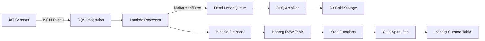

# Lean-Ops: IoT Event Data Platform

A scalable, fail-aware data platform designed to ingest high-velocity IoT sensor data, process it through resiliency layers, and deliver curated insights via Apache Iceberg arrays.

## Data Flow Architecture

This platform manages the end-to-end lifecycle of sensor data:



## System Overview

The system is built on a modular Terraform architecture designed to handle:
1.  **Ingestion**: High-throughput event buffering via SQS and Kinesis Firehose.
2.  **Resilience**: Automated handling of bad data (schema drift, malformed payloads) without stopping the pipeline.
3.  **Storage**: Acid-compliant Apache Iceberg tables on S3 for both raw and curated data.
4.  **Curation**: Scheduled processing to clean, deduplicate, and aggregate raw sensor data.

## Key Features

### Fail-Aware Processing
The pipeline implements a "fail-aware" pattern to ensure data integrity:
- **Schema Drift Tolerance**: Unexpected fields in IoT payloads are captured in a generic `json_payload` column instead of causing failures.
- **Error Routing**: Malformed data is dropped immediately; transient errors are retried; persistent failures are routed to a DLQ and archived to S3.
- **Circuit Breaking**: Automated mechanisms pause ingestion if error rates exceed safety thresholds (e.g., >50%).

### Modular Infrastructure
The codebase is organized into granular Terraform modules:

| Module | Description |
|--------|-------------|
| `modules/ingestion` | Kinesis Firehose delivery streams and buffering configuration |
| `modules/compute` | Lambda functions for signal processing and error handling |
| `modules/messaging` | SQS queues for per-topic event buffering |
| `modules/catalog` | Glue Data Catalog and Iceberg table definitions |
| `modules/orchestration` | Step Functions for managing curation workflows |
| `modules/observability` | CloudWatch alarms and SNS notification topics |

## Deployment

### Prerequisites
- Terraform >= 1.5
- AWS CLI configured

### Quick Start

1.  **Configure Environment**
    ```bash
    cp environments/dev.tfvars environments/prod.tfvars
    # Edit variables (account_id, region, buckets)
    ```

2.  **Deploy Modules**
    ```bash
    terraform init
    terraform apply -var-file="environments/prod.tfvars"
    ```

3.  **Verify Ingestion**
    Use the included data injector to simulate IoT traffic:
    ```bash
    python3 tools/data_injector/main.py --config tests/configs/happy_path.json
    ```

## Operations

### Monitoring
- **Dashboards**: CloudWatch metrics for Ingestion Lag (SQS) and Delivery Latency (Firehose).
- **Alerts**: Notifications for DLQ non-empty status and high error rates.

### Error Handling
- **Recoverable Errors**: Automatically retried with exponential backoff.
- **Poison Messages**: Archived to `s3://.../dlq-archive/` for offline analysis and replay.


