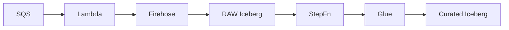

# Lean-Ops: IoT Event Data Platform

A scalable, fail-aware data platform designed to ingest high-velocity IoT sensor data from EKS pods, process through resiliency layers, and deliver curated insights via Apache Iceberg tables.

## Current Status (Phase 2 Complete)

✅ **Robust Ingestion**: SQS → Lambda → Firehose handles 700+ topics with FIFO/LIFO dedup.
✅ **Snapshot-Based Processing**: Incremental reads using Iceberg snapshots, not just timestamps.
✅ **Schema Evolution & Management**: Automated schema validation (Linter), deployment, and dynamic evolution.
✅ **Step Functions Orchestration**: Dynamic Master Pipeline Orchestrator and Historical Rebuilder for breaking schema changes.
✅ **Error Injection Framework**: Production-grade generator for testing scenarios (duplicates, late arrivals, schema drift, CDE violations).
✅ **Verified Reliability**: 
   - **Parse Errors**: 100% capture of malformed JSON.
   - **CDE Validation**: 100% capture of null critical fields (verified via 3% injection test).
   - **Data Accountability**: >99.9% record tracking from Ingestion to Curated.

## Architecture

```
EKS Pods (700+ topics)
         │
         ▼
    SQS Queues (per topic)
         │
         ▼
┌────────────────────────────────────────────────────────────────────┐
│                    INGESTION LAYER                                   │
│  ┌──────────────────┐    ┌──────────────────┐    ┌────────────────┐ │
│  │  SQS Processor   │───▶│    Firehose      │───▶│  Iceberg RAW   │ │
│  │  Lambda          │    │    (shared)      │    │  Tables        │ │
│  └────────┬─────────┘    └──────────────────┘    └────────────────┘ │
│           │                       │                                  │
│           ▼                       ▼                                  │
│  ┌──────────────────┐    ┌──────────────────┐                       │
│  │ Centralized DLQ  │    │ Firehose         │                       │
│  │                  │    │ Transform Lambda │                       │
│  └────────┬─────────┘    │ (otfMetadata)    │                       │
│           │              └──────────────────┘                       │
│           ▼                                                          │
│  ┌──────────────────┐                                               │
│  │  DLQ Processor   │───▶ S3 Archive + DynamoDB                     │
│  └──────────────────┘                                               │
└────────────────────────────────────────────────────────────────────┘
         │
         ▼
┌────────────────────────────────────────────────────────────────────┐
│                    PROCESSING LAYER (Step Functions)               │
│  Master Pipeline Orchestrator (15m Schedule)                       │
│  DynamoDB Registry → Map State (Concurrency: 30)                   │
│                                                                    │
│  Per-Topic Branch:                                                 │
│  ┌──────────────────┐    ┌──────────────────┐                      │
│  │ Standardized Job │───▶│ Curated Job      │                      │
│  │ (dedup/flatten)  │    │ (typed/governed) │                      │
│  └──────────────────┘    └──────────────────┘                      │
│                                                                    │
│  Historical Rebuilder (Triggered by Schema Deployer)               │
│  DynamoDB Pause → Full RAW Scan → Re-flatten → Unpause             │
└────────────────────────────────────────────────────────────────────┘
         │
         ▼
    Snowflake (External Managed Iceberg Table)
```

### Data Flow (Simplified)



### Glue Job Structure

```
scripts/glue/
├── standardized_processor.py  # RAW → Standardized (FIFO dedup, flatten)
├── curated_processor.py       # Standardized → Curated (CDE validation, type casting)
├── requirements.txt           # Dependencies
└── utils/
    ├── config.py              # Logging, constants
    ├── flatten.py             # Deep JSON flattening
    └── schema_evolution.py    # Column addition, alignment
```


### Multi-Topic Routing
- Single shared Firehose stream handles 700+ topics
- Lambda Transform adds `otfMetadata` to route to correct Iceberg table
- Topic extracted from SQS queue ARN

### Fail-Aware Processing
| Error Type | Action | Outcome |
|------------|--------|---------|
| Malformed JSON | DROP | Logged, not retried |
| Throttling | RETRY | Exponential backoff |
| Unknown | RETRY → DLQ | Archived to S3 |

### Circuit Breaker
- CloudWatch alarm on error rate > 50%
- Lambda auto-disables SQS event source mapping
- Prevents cascading failures

### Common Library
All Lambdas share utilities via `lambda/common/`:
- `topic_utils.py` - Extract topic from ARNs
- `error_classification.py` - DROP/RETRY logic
- `aws_clients.py` - Lazy boto3 client factories
- `checkpoint_utils.py` - Iceberg/DynamoDB queries

## Terraform Modules

| Module | Resources |
|--------|-----------|
| `compute` | Lambdas (SQS Processor, Firehose Transform, DLQ Processor, Circuit Breaker, GetAllCheckpoints) |
| `ingestion` | Kinesis Firehose, CloudWatch Logs |
| `messaging` | SQS queues, Centralized DLQ |
| `catalog` | Glue Database, Iceberg tables |
| `state` | DynamoDB (checkpoints, locks, error_tracker) |
| `storage` | S3 bucket references |
| `orchestration` | Step Functions, EventBridge schedules |
| `observability` | CloudWatch alarms, SNS topics |

## Deployment

### Prerequisites
- Terraform >= 1.5
- AWS CLI configured with profile `terraform-firehose`
- S3 buckets pre-created: `lean-ops-development-iceberg`, `lean-ops-development-schemas`

### Quick Start

```bash
# 1. Build Lambda packages (includes common library)
./scripts/build_lambdas.sh

# 2. Build Glue package (creates glue_libs.zip with utils/)
./scripts/build_glue.sh

# 3. Initialize Terraform
terraform init

# 4. Deploy infrastructure
AWS_PROFILE=terraform-firehose terraform apply -var-file="environments/dev.tfvars"

# 5. Upload Glue artifacts and schema to S3
./scripts/build_glue.sh --upload
AWS_PROFILE=terraform-firehose aws s3 cp schemas/events.json s3://lean-ops-development-iceberg/schemas/events.json

# 6. Destroy (when done)
AWS_PROFILE=terraform-firehose terraform destroy -var-file="environments/dev.tfvars"
```

### Environment Variables

| Variable | Description |
|----------|-------------|
| `project_name` | Resource name prefix |
| `environment` | dev/staging/prod |
| `topics` | List of topic names |
| `iceberg_bucket` | S3 bucket for Iceberg data |
| `schema_bucket` | S3 bucket for schema files |

## Testing

### Unit Tests
```bash
# Create venv and install pytest
python3 -m venv .venv
source .venv/bin/activate
pip install pytest boto3 moto

# Run tests
pytest tests/test_common.py -v
```

### Integration Tests
See `tests/TEST_PLAN.md` for end-to-end test scenarios.

## Documentation

| Document | Description |
|----------|-------------|
| `docs/RELEASE_NOTES.md` | Version history (Wave 1-3) |
| `docs/ROADMAP.md` | Upcoming features (Wave 4-6) |
| `docs/operations_plan.md` | Operational runbook |
| `docs/layer_definitions.md` | RAW/Curated/Semantic layer specs |
| `docs/step_functions_architecture.md` | Detailed architecture of Master Orchestrator and Historical Rebuilder |
| `docs/schema_management_integration.md` | Pipeline explanation of CI Linter and CD Deployer integration |
| `docs/lessons_learned_curated.md` | CDE Validation & Error Injection learnings |
| `architecture_feedback/comprehensive_feedback.md` | Step Function design |
| `architecture_feedback/snowflake_iceberg_recommendation.md` | Snowflake integration guide |

## Repository Structure

```
lean-ops/
├── main.tf                    # Root module
├── environments/
│   └── dev.tfvars            # Environment config
├── modules/
│   ├── compute/
│   │   ├── main.tf
│   │   └── lambda/
│   │       ├── common/       # Shared utilities
│   │       ├── sqs_processor/
│   │       ├── firehose_transform/
│   │       ├── dlq_processor/
│   │       ├── circuit_breaker/
│   │       └── get_all_checkpoints/
│   ├── ingestion/
│   ├── messaging/
│   ├── catalog/
│   ├── state/
│   ├── storage/
│   ├── orchestration/
│   └── observability/
├── scripts/
│   └── build_lambdas.sh      # Lambda packaging
├── tests/
│   ├── test_common.py        # Unit tests
│   └── TEST_PLAN.md
└── docs/
    ├── RELEASE_NOTES.md
    └── ROADMAP.md
```

## License

Internal use only.
