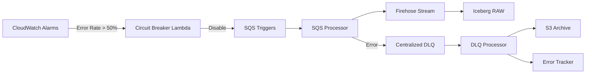

# Lean-Ops: Resilient Iceberg Data Pipeline

A simplified, fail-aware data pipeline implementing **Iceberg V2** on AWS. Built with Modular Terraform and Python, designed for high throughput and fault tolerance.

## 🏗 Architecture



## 🚀 Features (Wave 2)

| Feature | Status | Description |
|---------|--------|-------------|
| **Schema Drift** | ✅ | Automatically handles unexpected fields in `json_payload` |
| **Fail-Aware Processing** | ✅ | `classify_error()` routes exceptions (DROP vs RETRY) |
| **Centralized DLQ** | ✅ | All topic failures route to single DLQ with archiving |
| **Circuit Breaker** | ✅ | Disables ingestion during high error rates |
| **Modular Terraform** | ✅ | 8 granular modules (compute, messaging, etc.) |

## 📦 Modules

| Module | Purpose | Resources |
|--------|---------|-----------|
| `modules/ingestion` | Firehose delivery stream to Iceberg | 8 |
| `modules/compute` | SQS Processor, DLQ Processor, Circuit Breaker | 12 |
| `modules/messaging` | SQS queues per topic + Centralized DLQ | 4+ |
| `modules/state` | DynamoDB tables (checkpoints, locks, errors) | 6 |
| `modules/observability` | CloudWatch Alarms + SNS Alerts | 4 |

## 🧪 Verification Results

| Scenario | Result | Status |
|----------|--------|--------|
| **Happy Path** | 5,000 records processed at ~1,200/sec | ✅ |
| **Malformed JSON** | Logged as `DROPPING` (no retry) | ✅ |
| **Processing Error** | Retried 3x → DLQ → S3 Archive | ✅ |
| **DLQ Archival** | Failed messages stored in `s3://.../dlq-archive/` | ✅ |
| **DynamoDB Logging** | Errors logged with metadata in `error_tracker` | ✅ |

## 🛠 Deployment

```bash
# 1. Configure Environment
cp environments/dev.tfvars environments/prod.tfvars

# 2. Deploy Infrastructure
aws-vault exec your-profile -- terraform apply -var-file="environments/dev.tfvars"

# 3. Inject Test Data (Optional)
python3 tools/data_injector/main.py --config tests/configs/thundering_herd.json
```

## 📚 Lessons Learned

### Critical Fixes
1. **SQS Visibility vs Lambda Timeout**:
   - *Issue*: 30s SQS visibility < 60s Lambda timeout caused duplicating messages.
   - *Fix*: Set SQS Visibility to `300s`, Lambda Timeout to `30s`.
2. **DynamoDB Key Mismatch**:
   - *Issue*: Lambda used generic `pk` keys vs Terraform `topic_name` schema.
   - *Fix*: Aligned Lambda code to match strict Terraform schema.
3. **ReportBatchItemFailures**:
   - *Issue*: Failed batch items were being deleted.
   - *Fix*: Enabled partial batch responses in ESM.

## 🔮 Next Steps (Wave 3)
- [ ] **Water Balance Monitoring**: Compare record counts (RAW vs Semantic).
- [ ] **DLQ Age Alarm**: Alert on messages older than 7 days.
- [ ] **BisectBatchOnFunctionError**: optimizing large batch retries.

