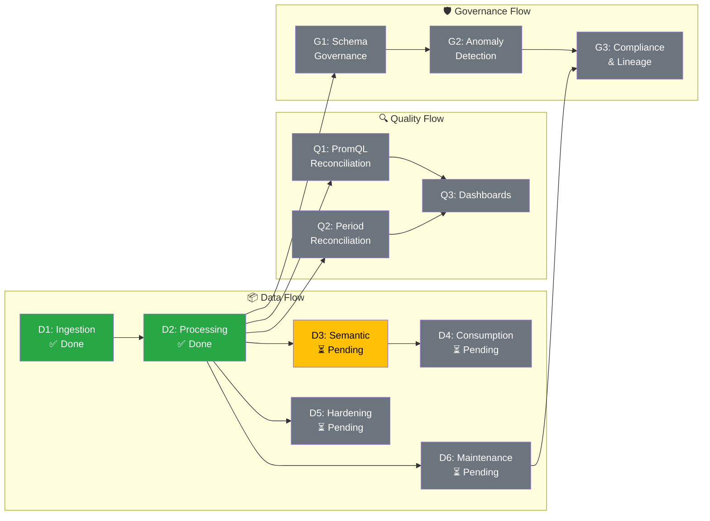

# Iceberg Data Lake: Project Plan

**Project**: IoT Event Data Platform  
**Goal**: Reduce adoption barriers, improve resiliency/scalability, enable support insights  
**Date**: 2026-01-22  

---

## Executive Summary

This project builds an enterprise data lake on Apache Iceberg with three distinct flows:

| Flow | Purpose | Status |
|------|---------|--------|
| **Data Flow** | Move data from IoT → GCP → SQS → Iceberg (RAW/Standardized/Curated) | 70% Complete |
| **Quality Flow** | Reconciliation, auditability, data matching | Not Started |
| **Governance Flow** | Schema drift tracking, anomaly detection, compliance | Not Started |

---

## 📊 Schedule Variance (Planned vs Actual)

> **How to read this:** "Planned" = where we should be. "Actual" = where we are. Red = behind schedule.

| Week | Planned Milestone | Actual Status | Variance |
|------|-------------------|---------------|----------|
| W1 | D1.1 SQS Processor Lambda | ✅ Complete | On Track |
| W2 | D1.4 DLQ Processor Lambda | 🔴 **Still Here** | Behind |
| W3 | D2.1 Standardized Glue Job | ⏳ Not Started | -1 Week |
| W4 | D2.2 Curated Glue Job | ⏳ Not Started | -2 Weeks |
| W5 | D2.3 Step Function Orchestrator | ⏳ Not Started | -3 Weeks |
| W6 | D2.6 Error Injection Framework | ⏳ Not Started | -4 Weeks |

### Current Position Summary
```
PLANNED TIMELINE (Baseline)
━━━━━━━━━━━━━━━━━━━━━━━━━━━━━━━━━━━━━━━━━━━━━━━━━━━━━━━━━━━━━━
W1    W2    W3    W4    W5    W6    W7    W8    W9    W10
|     |     |     |     |     |     |     |     |     |
▓▓▓▓▓ ▓▓▓▓▓ ▓▓▓▓▓ ▓▓▓▓▓ ▓▓▓▓▓ ▓▓▓▓▓ ░░░░░ ░░░░░ ░░░░░ ░░░░░
D1.1  D1.4  D2.1  D2.2  D2.3  D2.6  D3.1  D3.2  D4.1  D4.2
SQS   DLQ   Std   Cur   Step  Err   Sem   Sem   Snow  Lake
                        Func  Inj   Def   Job   EMIT  Form
                              ↑
                              Should be HERE by W6

ACTUAL PROGRESS (Current)
━━━━━━━━━━━━━━━━━━━━━━━━━━━━━━━━━━━━━━━━━━━━━━━━━━━━━━━━━━━━━━
W1    W2    W3    W4    W5    W6    W7    W8    W9    W10
|     |     |     |     |     |     |     |     |     |
██████ ▓▓▓▓▓
D1.1  D1.4
SQS   DLQ ← We are HERE (W2)
      ↑
      🔴 2+ WEEKS BEHIND SCHEDULE
```

---

## Mermaid Gantt Chart (Planned vs Actual)

```mermaid
gantt
    title Iceberg Data Lake - Planned vs Actual Progress
    dateFormat  YYYY-MM-DD
    excludes    weekends
    todayMarker stroke-width:3px,stroke:#ff0000

    section Baseline (Planned)
    D1: Ingestion (Planned)      :done,    bp1, 2026-01-06, 10d
    D2: Processing (Planned)     :done,    bp2, after bp1, 20d
    D3: Semantic (Planned)       :         bp3, after bp2, 11d
    D4: Consumption (Planned)    :         bp4, after bp3, 8d

    section Actual Progress
    D1.1 SQS Processor           :done,    a1, 2026-01-06, 3d
    D1.2-D1.6 Ingestion          :active,  a2, after a1, 7d
    D2.1 Standardized (Not Started) :crit, a3, after a2, 5d
    D2.2 Curated (Not Started)   :crit,    a4, after a3, 5d

    section Milestones
    Today (Jan 22)               :milestone, today, 2026-01-22, 0d
    Planned: Curated Done        :milestone, mp1, 2026-01-24, 0d
    Actual: Still at DLQ         :crit, milestone, ma1, 2026-01-22, 0d
```

### Schedule Variance by Task (Excel CSV)

Add this **Variance** column to your Excel data to show slippage:

```csv
Task,Category,Status,Planned Day,Actual Day,Duration,Variance (Days),On Track?
D1.1 SQS Processor Lambda,1-Data,Done,1,1,3,0,Yes
D1.2 Firehose Transform Lambda,1-Data,Done,4,4,2,0,Yes
D1.3 Multi-topic Routing,1-Data,Done,6,6,2,0,Yes
D1.4 DLQ Processor Lambda,1-Data,In Progress,6,8,2,+2,🔴 No
D1.5 Circuit Breaker,1-Data,Not Started,8,12,2,+4,🔴 No
D1.6 Error Classification,1-Data,Not Started,8,12,1,+4,🔴 No
D2.1 Standardized Glue Job,1-Data,Not Started,11,16,5,+5,🔴 No
D2.2 Curated Glue Job,1-Data,Not Started,16,21,5,+5,🔴 No
D2.3 Step Function Orchestrator,1-Data,Not Started,21,26,3,+5,🔴 No
```

### Excel Conditional Formatting for Variance

To highlight slippage in Excel:
1. Select the **Variance** column
2. **Home → Conditional Formatting → Highlight Cells Rules → Greater Than → 0**
3. Choose **Red Fill with Dark Red Text**
4. Repeat with **Less Than → 0** for **Green** (ahead of schedule)

---

```mermaid
gantt
    title Iceberg Data Lake - Full Project Timeline
    dateFormat  YYYY-MM-DD
    excludes    weekends

    section Data Flow
    D1: Ingestion Layer         :done,    d1, 2026-01-06, 10d
    D2: Processing Layer        :done,    d2, after d1, 20d
    D3: Semantic Layer          :active,  d3, after d2, 11d
    D4: Consumption Layer       :         d4, after d3, 8d
    D5: Production Hardening    :         d5, 2026-02-10, 11d
    D6: Maintenance             :         d6, after d4, 8d

    section Quality Flow
    Q1: PromQL Reconciliation   :         q1, 2026-02-17, 11d
    Q2: Period Reconciliation   :         q2, after q1, 11d
    Q3: Quality Dashboards      :         q3, after q1, 8d

    section Governance Flow
    G1: Schema Governance       :         g1, 2026-02-17, 10d
    G2: Anomaly Detection       :         g2, after g1, 9d
    G3: Compliance & Lineage    :         g3, after g2, 13d

    section Milestones
    Data MVP Complete           :milestone, m1, 2026-02-07, 0d
    Semantic Layer Ready        :milestone, m2, 2026-03-03, 0d
    Snowflake Live              :milestone, m3, 2026-03-14, 0d
    Quality Flow Live           :milestone, m4, 2026-03-21, 0d
    Governance Complete         :milestone, m5, 2026-04-04, 0d
```

---

## Dependency Flow Diagram



---

## Flow 1: Data Flow (Ingestion → Processing → Consumption)

### Phase D1: Ingestion Layer ✅ COMPLETE (Waves 1-2)

| ID | Task | Duration | Dependencies | Status |
|----|------|----------|--------------|--------|
| D1.1 | SQS Processor Lambda (business key extraction) | 3d | - | ✅ Done |
| D1.2 | Firehose Transform Lambda (otfMetadata routing) | 2d | D1.1 | ✅ Done |
| D1.3 | Multi-topic SQS → Firehose routing | 2d | D1.2 | ✅ Done |
| D1.4 | DLQ Processor Lambda | 2d | D1.1 | ✅ Done |
| D1.5 | Circuit Breaker (CloudWatch + Lambda) | 2d | D1.4 | ✅ Done |
| D1.6 | Error Classification (DROP/RETRY) | 1d | D1.1 | ✅ Done |

### Phase D2: Processing Layer ✅ COMPLETE (Waves 3-4)

| ID | Task | Duration | Dependencies | Status |
|----|------|----------|--------------|--------|
| D2.1 | Standardized Glue Job (FIFO dedup, flatten) | 5d | D1.3 | ✅ Done |
| D2.2 | Curated Glue Job (CDE validation, type casting) | 5d | D2.1 | ✅ Done |
| D2.3 | Step Function Orchestrator | 3d | D2.1, D2.2 | ✅ Done |
| D2.4 | Schema-Gated Processing (S3 schema check) | 2d | D2.3 | ✅ Done |
| D2.5 | Snapshot-Based Incremental Reads | 3d | D2.1 | ✅ Done |
| D2.6 | Error Injection Framework (testing) | 3d | D2.2 | ✅ Done |
| D2.7 | Parse Errors Table (malformed JSON routing) | 2d | D2.1 | ✅ Done |
| D2.8 | CDE Errors Table (validation failures) | 2d | D2.2 | ✅ Done |

### Phase D3: Semantic Layer ⏳ PENDING (Wave 4.5)

| ID | Task | Duration | Dependencies | Status |
|----|------|----------|--------------|--------|
| D3.1 | Semantic Schema Definition (typed, aggregated) | 3d | D2.2 | ⏳ Pending |
| D3.2 | Semantic Glue Job (Curated → Semantic) | 4d | D3.1 | ⏳ Pending |
| D3.3 | Semantic Table DDL (partitioned by use case) | 2d | D3.1 | ⏳ Pending |
| D3.4 | Step Function Integration (add semantic state) | 2d | D3.2, D2.3 | ⏳ Pending |

### Phase D4: Consumption Layer ⏳ PENDING (Wave 5)

| ID | Task | Duration | Dependencies | Status |
|----|------|----------|--------------|--------|
| D4.1 | Snowflake External Iceberg Table (EMIT) | 3d | D3.2 | ⏳ Pending |
| D4.2 | Lake Formation Permissions | 2d | D4.1 | ⏳ Pending |
| D4.3 | Athena Workgroup for Analytics | 1d | D3.3 | ⏳ Pending |
| D4.4 | Schema Refresh Automation | 2d | D4.1 | ⏳ Pending |

### Phase D5: Production Hardening ⏳ PENDING (Wave 6)

| ID | Task | Duration | Dependencies | Status |
|----|------|----------|--------------|--------|
| D5.1 | CI/CD Pipeline (GitHub Actions) | 3d | D2.3 | ⏳ Pending |
| D5.2 | KMS Encryption (S3/DynamoDB) | 2d | - | ⏳ Pending |
| D5.3 | VPC Deployment (Private Subnets) | 3d | D5.2 | ⏳ Pending |
| D5.4 | Least-Privilege IAM Policies | 2d | D5.3 | ⏳ Pending |
| D5.5 | Remote Terraform State (S3+Locking) | 1d | - | ⏳ Pending |

### Phase D6: Maintenance ⏳ PENDING (Wave 7)

| ID | Task | Duration | Dependencies | Status |
|----|------|----------|--------------|--------|
| D6.1 | Iceberg Snapshot Expiration Job | 2d | D2.1 | ⏳ Pending |
| D6.2 | Manifest Rewrite Automation | 2d | D6.1 | ⏳ Pending |
| D6.3 | Orphan File Cleanup Job | 1d | D6.1 | ⏳ Pending |
| D6.4 | Table Health Monitoring Dashboards | 3d | D6.1 | ⏳ Pending |

---

## Flow 2: Quality Flow (Reconciliation & Audit)

### Phase Q1: PromQL Reconciliation ⏳ NOT STARTED

| ID | Task | Duration | Dependencies | Status |
|----|------|----------|--------------|--------|
| Q1.1 | PromQL Query Builder (GCP publish counts) | 3d | - | ⏳ Pending |
| Q1.2 | Reconciliation Lambda (hourly trigger) | 3d | Q1.1 | ⏳ Pending |
| Q1.3 | RAW/Standardized/Curated Count Comparison | 2d | Q1.2 | ⏳ Pending |
| Q1.4 | Reconciliation Results Table (Iceberg) | 2d | Q1.3 | ⏳ Pending |
| Q1.5 | Alerting on Discrepancy Threshold | 1d | Q1.4 | ⏳ Pending |

### Phase Q2: Period Reconciliation ⏳ NOT STARTED

| ID | Task | Duration | Dependencies | Status |
|----|------|----------|--------------|--------|
| Q2.1 | Period Reconciliation Topic Consumer | 2d | - | ⏳ Pending |
| Q2.2 | Reconciliation Iceberg Table (transactions) | 2d | Q2.1 | ⏳ Pending |
| Q2.3 | Row Count Validation (RAW vs Standardized) | 2d | Q2.2 | ⏳ Pending |
| Q2.4 | Value Matching (Curated vs Source) | 3d | Q2.3 | ⏳ Pending |
| Q2.5 | Audit Trail Table (all results) | 2d | Q2.4 | ⏳ Pending |

### Phase Q3: Quality Dashboards ⏳ NOT STARTED

| ID | Task | Duration | Dependencies | Status |
|----|------|----------|--------------|--------|
| Q3.1 | Grafana/QuickSight Dashboard Setup | 3d | Q1.4, Q2.5 | ⏳ Pending |
| Q3.2 | Data Freshness Metrics | 2d | Q3.1 | ⏳ Pending |
| Q3.3 | Reconciliation Score Trend | 2d | Q3.1 | ⏳ Pending |
| Q3.4 | Operational Alerts Integration | 1d | Q3.1 | ⏳ Pending |

---

## Flow 3: Governance Flow (Lineage, Drift, Compliance)

### Phase G1: Schema Governance ⏳ NOT STARTED

| ID | Task | Duration | Dependencies | Status |
|----|------|----------|--------------|--------|
| G1.1 | Schema Drift Detection (Glue → S3 compare) | 3d | D2.1 | ⏳ Pending |
| G1.2 | Drift Log Table (all detected changes) | 2d | G1.1 | ⏳ Pending |
| G1.3 | Column Addition Tracking | 2d | G1.2 | ⏳ Pending |
| G1.4 | Column Removal Alerting | 1d | G1.2 | ⏳ Pending |
| G1.5 | Type Change Detection | 2d | G1.2 | ⏳ Pending |

### Phase G2: Anomaly Detection ⏳ NOT STARTED

| ID | Task | Duration | Dependencies | Status |
|----|------|----------|--------------|--------|
| G2.1 | Record Count Baseline Calculation | 2d | D2.2 | ⏳ Pending |
| G2.2 | Anomaly Detection Lambda (hourly) | 3d | G2.1 | ⏳ Pending |
| G2.3 | Volume Spike/Drop Alerting | 2d | G2.2 | ⏳ Pending |
| G2.4 | Anomaly History Table | 2d | G2.2 | ⏳ Pending |
| G2.5 | ML-Based Pattern Detection (optional) | 5d | G2.4 | 🔮 Future |

### Phase G3: Compliance & Lineage ⏳ NOT STARTED

| ID | Task | Duration | Dependencies | Status |
|----|------|----------|--------------|--------|
| G3.1 | Data Lineage Tracking (OpenLineage/Atlas) | 5d | D2.3 | ⏳ Pending |
| G3.2 | Processing Audit Log (all transformations) | 3d | G3.1 | ⏳ Pending |
| G3.3 | Retention Policy Implementation | 2d | D6.1 | ⏳ Pending |
| G3.4 | Compliance Dashboard | 3d | G3.2 | ⏳ Pending |

---

## Excel Gantt Chart (Step-by-Step Instructions)

### Step 1: Copy This CSV Data

```csv
Task,Category,Status,Start Day,Duration,End Day
D1.1 SQS Processor Lambda,1-Data,Done,1,3,4
D1.2 Firehose Transform Lambda,1-Data,Done,4,2,6
D1.3 Multi-topic Routing,1-Data,Done,6,2,8
D1.4 DLQ Processor Lambda,1-Data,Done,6,2,8
D1.5 Circuit Breaker,1-Data,Done,8,2,10
D1.6 Error Classification,1-Data,Done,8,1,9
D2.1 Standardized Glue Job,1-Data,Done,11,5,16
D2.2 Curated Glue Job,1-Data,Done,16,5,21
D2.3 Step Function Orchestrator,1-Data,Done,21,3,24
D2.4 Schema-Gated Processing,1-Data,Done,24,2,26
D2.5 Snapshot-Based Reads,1-Data,Done,24,3,27
D2.6 Error Injection Framework,1-Data,Done,27,3,30
D3.1 Semantic Schema Definition,1-Data,Pending,31,3,34
D3.2 Semantic Glue Job,1-Data,Pending,34,4,38
D3.3 Semantic Table DDL,1-Data,Pending,34,2,36
D3.4 Step Function Integration,1-Data,Pending,38,2,40
D4.1 Snowflake EMIT,1-Data,Pending,41,3,44
D4.2 Lake Formation Permissions,1-Data,Pending,44,2,46
D4.3 Athena Workgroup,1-Data,Pending,41,1,42
D4.4 Schema Refresh Automation,1-Data,Pending,46,2,48
D5.1 CI/CD Pipeline,1-Data,Pending,31,3,34
D5.2 KMS Encryption,1-Data,Pending,31,2,33
D5.3 VPC Deployment,1-Data,Pending,33,3,36
D5.4 Least-Privilege IAM,1-Data,Pending,36,2,38
D6.1 Snapshot Expiration,1-Data,Pending,41,2,43
D6.2 Manifest Rewrite,1-Data,Pending,43,2,45
D6.3 Orphan File Cleanup,1-Data,Pending,45,1,46
D6.4 Health Monitoring,1-Data,Pending,45,3,48
Q1.1 PromQL Query Builder,2-Quality,Pending,36,3,39
Q1.2 Reconciliation Lambda,2-Quality,Pending,39,3,42
Q1.3 Count Comparison Logic,2-Quality,Pending,42,2,44
Q1.4 Reconciliation Table,2-Quality,Pending,44,2,46
Q1.5 Discrepancy Alerting,2-Quality,Pending,46,1,47
Q2.1 Period Recon Consumer,2-Quality,Pending,46,2,48
Q2.2 Transactions Table,2-Quality,Pending,48,2,50
Q2.3 Row Count Validation,2-Quality,Pending,50,2,52
Q2.4 Value Matching,2-Quality,Pending,52,3,55
Q2.5 Audit Trail Table,2-Quality,Pending,55,2,57
Q3.1 Dashboard Setup,2-Quality,Pending,47,3,50
Q3.2 Freshness Metrics,2-Quality,Pending,50,2,52
Q3.3 Reconciliation Trend,2-Quality,Pending,50,2,52
Q3.4 Alerts Integration,2-Quality,Pending,52,1,53
G1.1 Schema Drift Detection,3-Governance,Pending,36,3,39
G1.2 Drift Log Table,3-Governance,Pending,39,2,41
G1.3 Column Addition Tracking,3-Governance,Pending,41,2,43
G1.4 Column Removal Alerting,3-Governance,Pending,41,1,42
G1.5 Type Change Detection,3-Governance,Pending,43,2,45
G2.1 Record Count Baseline,3-Governance,Pending,46,2,48
G2.2 Anomaly Detection Lambda,3-Governance,Pending,48,3,51
G2.3 Volume Spike Alerting,3-Governance,Pending,51,2,53
G2.4 Anomaly History Table,3-Governance,Pending,51,2,53
G3.1 Data Lineage Tracking,3-Governance,Pending,55,5,60
G3.2 Processing Audit Log,3-Governance,Pending,60,3,63
G3.3 Retention Policy,3-Governance,Pending,55,2,57
G3.4 Compliance Dashboard,3-Governance,Pending,63,3,66
```

### Step 2: Paste into Excel
1. Open blank Excel workbook
2. Click cell **A1**
3. Paste the CSV data
4. If data appears in one column: **Data → Text to Columns → Delimited → Comma → Finish**

### Step 3: Create Stacked Bar Chart (Gantt Style)
1. Select data range **A1:F54** (including headers)
2. **Insert → Charts → Bar Chart → Stacked Bar**
3. Right-click chart → **Select Data**

### Step 4: Configure Series for Gantt
1. In "Select Data Source" dialog:
   - **Remove** "End Day" series (if present)
   - Keep only **Start Day** and **Duration**
2. Click **OK**

### Step 5: Make "Start Day" Invisible (Creates Gap)
1. Click on the **Start Day** bars (first color segment)
2. Right-click → **Format Data Series**
3. **Fill → No Fill**
4. **Border → No Line**

### Step 6: Set Up Categories (Y-Axis)
1. Right-click chart → **Select Data**
2. Click **Horizontal (Category) Axis Labels → Edit**
3. Select cells **A2:A54** (Task names)
4. Click **OK**

### Step 7: Reverse Y-Axis Order (Optional, but recommended)
1. Double-click the **Y-axis** (task names)
2. **Format Axis → Axis Options → Categories in reverse order** ✓

### Step 8: Color by Status (Legend)
1. Use Conditional Formatting OR manually color bars:
   - **Done** = Green (#28a745)
   - **Pending** = Gray (#6c757d)
   - **In Progress** = Yellow (#ffc107)

**Quick Color Method:**
1. Select the Duration bars
2. Click each bar segment individually (click once, then click again)
3. Right-click → **Format Data Point → Fill → Solid Fill** → Choose color

### Step 9: Add Category Legend
Since Excel's built-in legend shows series names (Start Day, Duration), create a manual legend:

1. **Insert → Shapes → Rectangle** (create 3 small boxes)
2. Color them:
   - Box 1: Blue → Label "Data Flow"
   - Box 2: Orange → Label "Quality Flow"  
   - Box 3: Purple → Label "Governance Flow"
3. Group and position next to chart

### Alternative: Use Category Column for Grouping
The "Category" column (1-Data, 2-Quality, 3-Governance) can be used for:
- **Pivot Table** filtering
- **Slicer** for interactive filtering
- Separate charts per category

---

### Quick Reference: Column Meanings

| Column | Purpose | Excel Usage |
|--------|---------|-------------|
| **Task** | Task name + ID | Y-axis labels |
| **Category** | Flow grouping (Data/Quality/Gov) | Filter/Legend color |
| **Status** | Done/Pending/In Progress | Bar color coding |
| **Start Day** | When task begins (Day 1 = Jan 6) | Hidden bar segment |
| **Duration** | How long task takes | Visible bar length |
| **End Day** | Auto-calculated (Start + Duration) | Optional reference |

---

## 📊 Excel: Phase-Level Planned vs Actual Chart

This creates the summary chart showing "where we should be" vs "where we are":

### Step 1: Phase Summary CSV (Copy This)

```csv
Phase,Flow,Planned Start,Planned Duration,Actual Start,Actual Duration,Status
D1 Ingest,DATA FLOW,1,10,1,10,Done
D2 Process,DATA FLOW,11,20,11,0,🔴 Behind
D3 Semantic,DATA FLOW,31,11,0,0,Not Started
D4 Consume,DATA FLOW,42,8,0,0,Not Started
D5 Harden,DATA FLOW,31,11,0,0,Not Started
D6 Maintain,DATA FLOW,50,8,0,0,Not Started
,,,,,,
Q1 PromQL,QUALITY FLOW,36,11,0,0,Not Started
Q2 Period,QUALITY FLOW,47,11,0,0,Not Started
Q3 Dashboard,QUALITY FLOW,47,8,0,0,Not Started
,,,,,,
G1 Schema,GOVERNANCE FLOW,36,10,0,0,Not Started
G2 Anomaly,GOVERNANCE FLOW,46,9,0,0,Not Started
G3 Lineage,GOVERNANCE FLOW,55,13,0,0,Not Started
```

### Step 2: Create the Chart

1. **Paste CSV** into Excel starting at cell A1
2. Select range **A1:G15** (all data including empty rows for section breaks)
3. **Insert → Bar Chart → Stacked Bar**

### Step 3: Configure for Planned vs Actual

1. Right-click chart → **Select Data**
2. Keep these series (in order):
   - **Planned Start** (will be invisible)
   - **Planned Duration** (gray bar = baseline)
   - **Actual Start** (will be invisible)  
   - **Actual Duration** (colored bar = progress)
3. Remove other series if present

### Step 4: Make Start Columns Invisible

1. Click on **Planned Start** bars → Right-click → **Format Data Series**
   - Fill: **No Fill**
   - Border: **No Line**
2. Repeat for **Actual Start** bars

### Step 5: Color the Duration Bars

**Planned Duration (Baseline):**
1. Click the Planned Duration bars
2. Format → Fill → **Light Gray (#D3D3D3)** or pattern fill (diagonal lines)

**Actual Duration (Progress):**
1. Click Actual Duration bars
2. For Done status: **Dark Green (#2E7D32)**
3. For Behind status: **Red (#C62828)**
4. For In Progress: **Yellow (#FBC02D)**

### Step 6: Add Section Headers (Flow Names)

1. The empty rows in CSV create visual breaks
2. Add text boxes for "DATA FLOW", "QUALITY FLOW", "GOVERNANCE FLOW"
3. Position above each section

### Step 7: Add Today Marker Line

1. **Insert → Shapes → Line**
2. Draw a vertical red line at today's position (Day 12 = W2)
3. Right-click line → **Format Shape → Line Color: Red, Weight: 2pt**
4. Add text box: "Today (W2)"

### Step 8: Final Formatting

```
Chart should look like:

D1 Ingest    ████████████████████ [Actual]     ✅ Done
             ░░░░░░░░░░░░░░░░░░░░ [Planned]
             
D2 Process   ░░░░░░░░░░░░░░░░░░░░░░░░░░░░░░░░░░░░░░░░ [Planned]
             ▓▓▓▓ [Actual - current position]   🔴 Behind
             |
             ↑ TODAY marker (red line)
             
D3 Semantic  ░░░░░░░░░░░░░░░░░░░░░░ [Planned only]
             [No actual bar - not started]
```

### Conditional Formatting for Status Column

1. Select **Status** column (G2:G15)
2. **Home → Conditional Formatting → Highlight Cells Rules → Text that Contains**
3. Add rules:
   - Contains "Done" → Green fill
   - Contains "Behind" → Red fill
   - Contains "Progress" → Yellow fill
   - Contains "Not Started" → Gray fill

### Excel Formula: Calculate Variance

Add this formula in column H to calculate days behind:

```excel
=IF(E2>0, (C2+D2)-(E2+F2), "N/A")
```

This shows: `(Planned End) - (Actual End)` = Days behind (negative = ahead)

---

## Key: How to Read the Chart

| Bar Type | Meaning |
|----------|---------|
| **Gray/Striped Bar** | Planned baseline (where you should be) |
| **Solid Dark Bar** | Actual progress (where you are) |
| **Red Vertical Line** | Today's date |
| **Gap between bars** | Schedule slippage |

## Visual Timeline (Text-Based Gantt)

```
Week:     W1   W2   W3   W4   W5   W6   W7   W8   W9   W10  W11  W12  W13  W14
          |    |    |    |    |    |    |    |    |    |    |    |    |    |

DATA FLOW
─────────────────────────────────────────────────────────────────────────────
D1 Ingest ████ ████                                           [DONE]
D2 Process           ████ ████ ████ ████                      [DONE]
D3 Semantic                          ▓▓▓▓ ▓▓▓▓ ▓▓▓▓           [PENDING]
D4 Consume                                     ░░░░ ░░░░      [PENDING]
D5 Harden                            ░░░░ ░░░░ ░░░░           [PENDING]
D6 Maintain                                    ░░░░ ░░░░      [PENDING]

QUALITY FLOW
─────────────────────────────────────────────────────────────────────────────
Q1 PromQL                            ░░░░ ░░░░ ░░░░           [NOT STARTED]
Q2 Period                                      ░░░░ ░░░░ ░░░░ [NOT STARTED]
Q3 Dashboard                                        ░░░░ ░░░░ [NOT STARTED]

GOVERNANCE FLOW
─────────────────────────────────────────────────────────────────────────────
G1 Schema                            ░░░░ ░░░░ ░░░░           [NOT STARTED]
G2 Anomaly                                     ░░░░ ░░░░      [NOT STARTED]
G3 Lineage                                          ░░░░ ░░░░ ░░░░ [NOT STARTED]

Legend: ████ = Done   ▓▓▓▓ = In Progress   ░░░░ = Pending
```

---

## Key Milestones

| Milestone | Target Week | Dependencies |
|-----------|-------------|--------------|
| **Data Flow MVP** (RAW → Curated) | W6 | D1, D2 ✅ Complete |
| **Semantic Layer Ready** | W9 | D3 |
| **Snowflake Live** | W11 | D4 |
| **Quality Flow Live** | W12 | Q1, Q2, Q3 |
| **Governance Complete** | W14 | G1, G2, G3 |
| **Production Hardened** | W10 | D5, D6 |

---

## Resource Allocation

| Role | Data Flow | Quality Flow | Governance Flow |
|------|-----------|--------------|-----------------|
| Data Engineer | 60% | 20% | 20% |
| DevOps/Platform | 30% | 10% | 10% |
| Security | 10% | - | 10% |
| Architect | Oversight | Review | Design |

---

## Risk Register

| Risk | Impact | Mitigation |
|------|--------|-----------|
| PromQL API rate limiting | Medium | Implement caching, reduce query frequency |
| Schema drift causes data loss | High | DDL before DML pattern, drift_log table |
| Snowflake EMIT sync lag | Medium | Scheduled REFRESH, monitoring alerts |
| Lambda concurrency exhaustion | High | DynamoDB (not RDS), async patterns |
